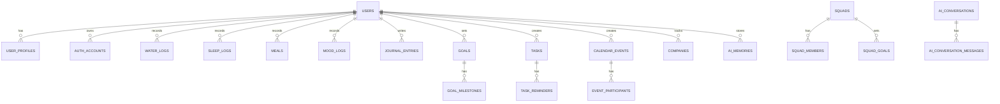

Mermaid ERD for DearMe

```mermaid
erDiagram
    USERS ||--o{ USER_PROFILES : has
    USERS ||--o{ AUTH_ACCOUNTS : owns
    USERS ||--o{ WATER_LOGS : records
    USERS ||--o{ SLEEP_LOGS : records
    USERS ||--o{ MEALS : records
    USERS ||--o{ MOOD_LOGS : records
    USERS ||--o{ JOURNAL_ENTRIES : writes
    USERS ||--o{ GOALS : sets
    USERS ||--o{ TASKS : creates
    USERS ||--o{ CALENDAR_EVENTS : creates
    USERS ||--o{ COMPANIES : tracks
    USERS ||--o{ AI_MEMORIES : stores
    SQUADS ||--o{ SQUAD_MEMBERS : has
    SQUADS ||--o{ SQUAD_GOALS : sets
    GOALS ||--o{ GOAL_MILESTONES : has
    TASKS ||--o{ TASK_REMINDERS : has
    CALENDAR_EVENTS ||--o{ EVENT_PARTICIPANTS : has
    AI_CONVERSATIONS ||--o{ AI_CONVERSATION_MESSAGES : has
```
